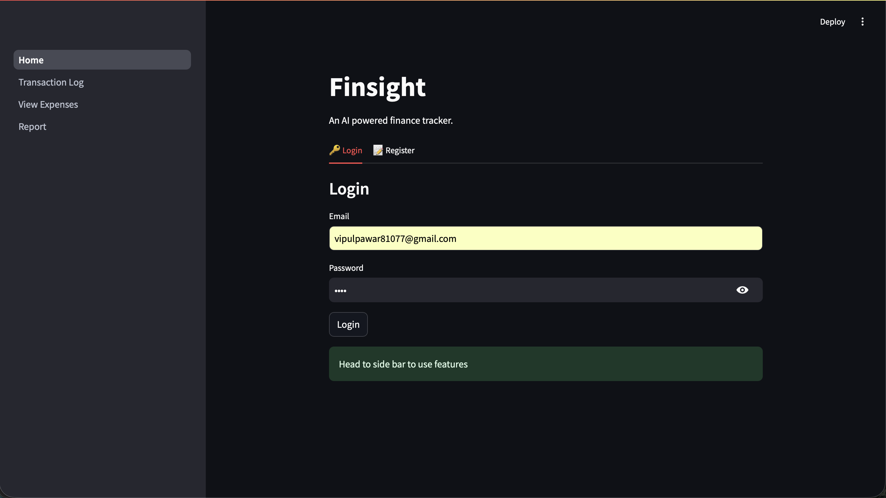
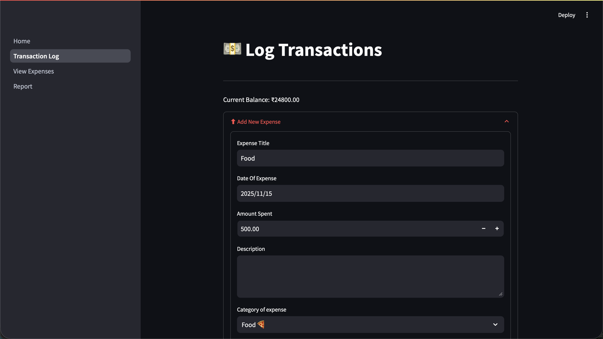
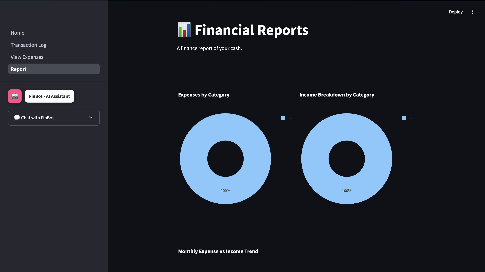
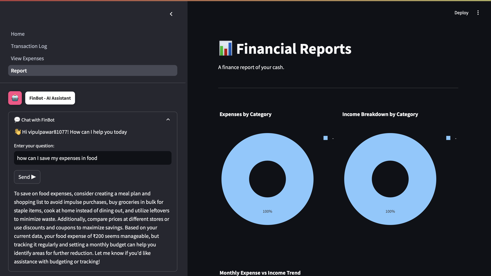

# Finsight - AI-Powered Personal Finance Tracker

Finsight is an AI-powered personal finance tracker built with Streamlit and Python. Features user authentication, expense/income logging, interactive charts, and FinBot - an AI assistant using Cohere for budgeting advice. Uses SQLite databases and Plotly visualizations for secure, multi-user financial management.

## 🚀 Features

- **User Authentication**: Secure login and registration system
- **Expense & Income Tracking**: Log transactions with categories and descriptions
- **Financial Reports**: Interactive charts and visualizations using Plotly
- **AI Assistant (FinBot)**: Get personalized budgeting advice powered by Cohere AI
- **Multi-user Support**: Each user has their own secure database
- **Real-time Balance**: Automatic calculation of account balance
- **Data Visualization**: Pie charts, bar charts, and trend analysis

## 🛠️ Tech Stack

- **Frontend**: Streamlit
- **Backend**: Python
- **Database**: SQLite
- **AI**: Cohere API
- **Visualization**: Plotly
- **Authentication**: Custom implementation with password hashing

## 📦 Installation

### Prerequisites
- Python 3.8+
- pip package manager

### Setup Instructions

1. **Clone the repository**
   ```bash
   git clone <repository-url>
   cd Finsight
   ```

2. **Create virtual environment**
   ```bash
   python3 -m venv .venv
   source .venv/bin/activate  # On Windows: .venv\Scripts\activate
   ```

3. **Install dependencies**
   ```bash
   pip install -r requirements.txt
   ```

4. **Set up environment variables**
   - Create a `.env` file in the root directory
   - Add your Cohere API key:
     ```
     COHERE_API_KEY=your_cohere_api_key_here
     ```

5. **Run the application**
   ```bash
   streamlit run Home.py
   ```

## 📖 Usage

1. **Registration**: Create a new account or login with existing credentials
2. **Transaction Logging**: Use the "Transaction Log" page to add expenses and income
3. **View Expenses**: Check your transaction history in the "View Expenses" page
4. **Financial Reports**: Analyze your finances with interactive charts in the "Report" page
5. **AI Assistant**: Chat with FinBot for personalized financial advice

## 📸 Screenshots

### Login Page

*Secure user authentication interface*

### Transaction Logging

*Add expenses and income with detailed categorization*

### Financial Reports

*Interactive charts showing expense breakdown and trends*

### AI Assistant (FinBot)

*AI-powered financial assistant for budgeting advice*

## 🔧 Project Structure

```
Finsight/
├── Home.py                      # Main application entry point
├── requirements.txt             # Python dependencies
├── .env.example                 # Environment variables template
├── .gitignore                   # Git ignore rules
├── README.md                    # This file
├── PROJECT_STRUCTURE.md         # Detailed structure documentation
│
├── .streamlit/                  # Streamlit configuration
│   ├── config.toml             # App configuration
│   └── secrets.toml            # API keys (gitignored)
│
├── src/                         # Source code
│   ├── __init__.py
│   ├── auth.py                 # Authentication module
│   ├── config.py               # Centralized configuration
│   └── utils/                  # Utility modules
│       ├── __init__.py
│       ├── expense_tracker.py  # Core expense tracking logic
│       └── finbot.py           # AI assistant module
│
├── pages/                       # Streamlit multipage app
│   ├── 1_Transaction_Log.py    # Add expenses & income
│   ├── 2_View_Expenses.py      # View transaction history
│   └── 3_Report.py             # Financial reports & charts
│
├── data/                        # Data storage (gitignored)
│   ├── databases/              # SQLite databases
│   │   ├── users.db           # User authentication
│   │   ├── admin.db           # Admin data
│   │   └── user_*.db          # User-specific databases
│   └── exports/                # Exported reports
│
├── assets/                      # Static assets
│   ├── images/                 # Application images
│   └── screenshots/            # Screenshots for README
│       ├── login.png
│       ├── transaction_log.png
│       ├── reports.png
│       └── finbot.png
│
├── tests/                       # Test files
│   └── __init__.py
│
└── docs/                        # Documentation
    ├── SETUP.md                # Detailed setup guide
    └── CONTRIBUTING.md         # Contribution guidelines
```

For more details about the project structure and organization, see [PROJECT_STRUCTURE.md](PROJECT_STRUCTURE.md).

## 🤖 FinBot - AI Assistant

FinBot is powered by Cohere's advanced language models and provides:
- Personalized budgeting advice
- Financial insights based on your transaction history
- Savings recommendations
- Expense analysis and suggestions

## 🔒 Security

- Passwords are hashed using SHA-256
- Each user has their own SQLite database
- API keys are stored securely in environment variables
- Sensitive files are excluded from version control

## 🤝 Contributing

1. Fork the repository
2. Create a feature branch (`git checkout -b feature/AmazingFeature`)
3. Commit your changes (`git commit -m 'Add some AmazingFeature'`)
4. Push to the branch (`git push origin feature/AmazingFeature`)
5. Open a Pull Request

## 🙏 Acknowledgments

- Streamlit for the amazing web app framework
- Cohere for AI capabilities
- Plotly for data visualization
- SQLite for lightweight database management

---

**Note**: Make sure to add your Cohere API key to the `.env` file before running the application. The AI features will be disabled if the API key is not configured.
